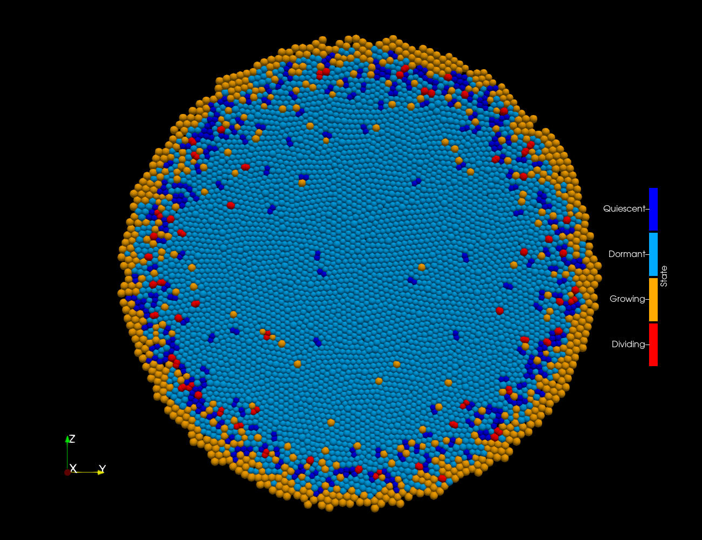
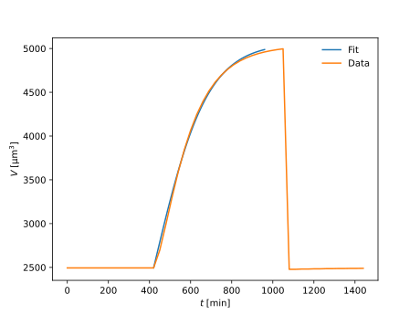
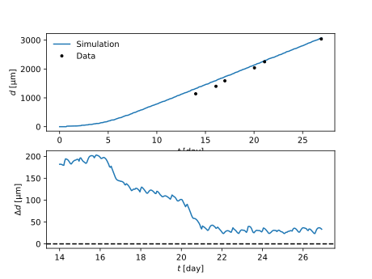
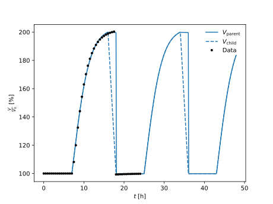

# Simulation of monolayer


This folder contain a monolayer growth simulation.
First part of the simulation is used also to provide information regarding 

# Content
 * [`data`](data) - contains experimental data about the cell cycle and monolayer
 * [`figures`](figures) - contains figures of results and images of the monolayer
 * [`scripts`](scripts) - contains pre-processing and post-processing scripts
 * [`src`](src) - contains the main source code of the simulation
 * [`results`](results) - contains aggregated results results from the simulation

# Pre-processing
The script [`scripts/fit_cell_cycle.py`](scripts/fit_cell_cycle.py)
was used to fit [the experimental data on cell cycle growth](data/cell_cycle.csv) and provide estimate for parameters for logistic growth.
To verify that the data are correctly fitted we provide a comparison:



Resulting parameters are also exported in `YAML` format into [`results/cell_cycle_parameters.yaml`](results/cell_cycle_parameters.yaml).

# Build and run
We use docker image to provide a pre-compiled version of the CompuTiX library. 
This setup will assume that you have downloaded the latest CompuTiX docker image.

## Prepare docker container 
Create a new container 
```bash
docker run -it -v "$(pwd):/monolayer" registry.gitlab.inria.fr/computix/computix/release:r25.07
```
where we assumed that it was launched from this folder.

## Build 
Once the container is created and running, one can proceed with build.
For build we use [CMake](https://cmake.org/) together with `gcc`.
For example assuming you are **inside the docker container** in the folder `/monolayer`
```bash
mkdir build
cd build
cmake ../src
make 
```

**Note:** Using `clang` is also possible but requires rebuilding the [CompuTiX library](https://gitlab.inria.fr/computix/computix) from scracth using the same compiler.

## Run
To run the simulation simply use
```bash
./simulation
```
from the `build` folder.

Use `-h` or `--help` option to see all possible options to control the run or look [here](src/main.cpp#L138-151).

# Postprocessing
When the simulation finishes one can find two sets of files:
 * `Cells_%04d.vtp` containing values per cells. 
   These files are mainly used for visualization in [Paraview](https://www.paraview.org/).
 * `Universes_%04d.xml` are XML files containing the whole state of the simulation at that point.
   One can use a `Python` package `computix.utils` provided inside the docker image to extract the values. 

## Extracting data
First step is to extract relevant degrees of freedom for the analysis from the XML files. 
For that we use `computix.utils` provided inside the docker image, thus this step has to be run from **inside the docker container**
```bash
python3 scripts/extract_cell_cycle.py build 
python3 scripts/extract_monolayer.py build
```
This should create files [`results/cell_volume.yaml`](results/cell_volume.yaml) and [`results/monolayer.yaml`](results/monolayer.yaml).

If you want different placement of the files or your simulation files are stored elsewhere check available command line of those scripts with `-h` or `--help`.

### Cell volume
[`cell_volume.yaml`](results/cell_volume.yaml) is generated by [`extract_cell_cycle.py`](scripts/extract_cell_cycle.py) 
and it contains three entries [`time`](results/cell_volume.yaml#L1) representing simulation time in *hours*, 
[`volume_per_child_cell`](results/cell_volume.yaml#L484) representing cell volume while during the mitosis phase a volume of a single daughter cell (in $`\mathrm{\mu m}^3`$),
[`volume_per_parent_cell`](results/cell_volume.yaml#L967) representing cell volume while during the mitosis phase a volume of the dumbell forming the two daughters (in $`\mathrm{\mu m}^3`$).

### Monolayer
[`monolayer.yaml`](results/monolayer.yaml) is generated by script [`extract_monolayer.py`](scripts/extract_monolayer.py) 
and it contains three entries [`time`](results/monolayer.yaml#L1303) representing simulation time in *hours*, 
[`N`](results/monolayer.yaml#L1) representing number of cells $`N`$,
[`d`](results/monolayer.yaml#L652) representing diameter of the whole monolayer measured as the maximal distance between centers of any two cells
```math
d = \max\limits_{ij} \| \vec{x}_i - \vec{x}_j \| .
``` 

## Plotting the figures
Figures can be then generated by using the scripts [`plot_cell_cycle.py`](scripts/plot_cell_cycle.py) and [`plot_monolayer.py`](scripts/plot_monolayer.py)
for which we also provide [`requirements.txt`](`scripts/requirements.txt`) to set up `venv`.

# Results
We were able to reproduce a monolayer growth



where top figure shows the overall growth and the bottom figure difference with experimental data lineraly interpolated in-between the datap points.

While at the same time we preserve the overall cell cycle characteristic 




